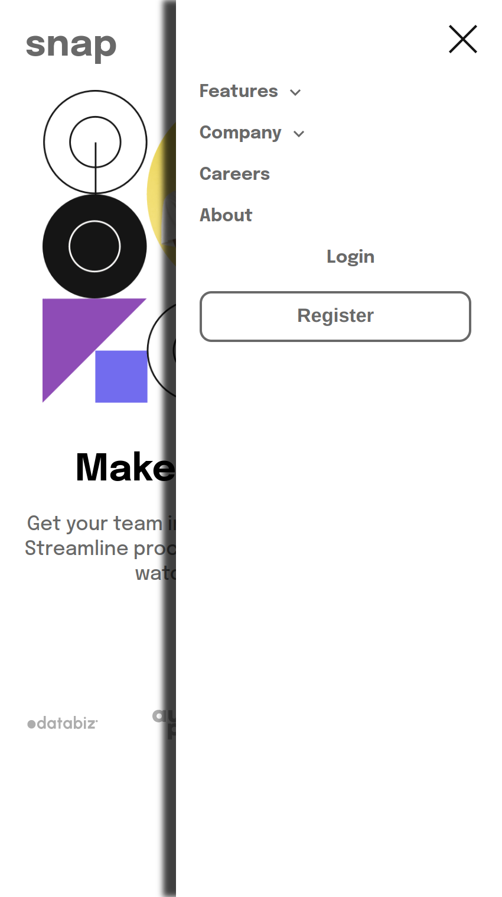
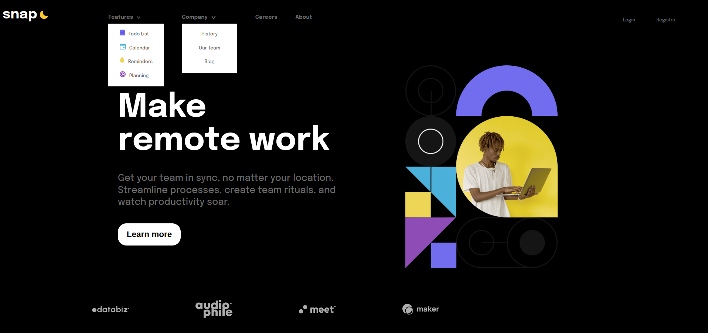

# Frontend Mentor - Intro section with dropdown navigation solution

This is a solution to the [Intro section with dropdown navigation challenge on Frontend Mentor](https://www.frontendmentor.io/challenges/intro-section-with-dropdown-navigation-ryaPetHE5). Frontend Mentor challenges help you improve your coding skills by building realistic projects. 

## Table of contents

  - [The challenge](#the-challenge)
  - [Screenshot](#screenshot)
  - [Links](#links)
  - [Built with](#built-with)
- [Author](#author)

### The challenge

Users should be able to:

- View the relevant dropdown menus on desktop and mobile when interacting with the navigation links
- View the optimal layout for the content depending on their device's screen size
- See hover states for all interactive elements on the page

### Screenshot

Mobile version light

Mobile Version dark

Mobile version Menu

Desktop Version light

Desktop Version dark

Desktop version menu show 

### Links

- Solution URL: [Add solution URL here](https://your-solution-url.com)
- Live Site URL: [Add live site URL here](https://your-live-site-url.com)

### Built with

- Semantic HTML5 markup
- CSS custom properties
- Flexbox
- CSS Grid
- Mobile-first workflow
-JavaScript-DOM

## Author

- Website - [My portfolio](https://portfoliofabio.netlify.app/)
- Frontend Mentor - [@fabiosmorinigo](https://www.frontendmentor.io/profile/fabiosmorinigo)
- Twitter - [@fabiosmorinigo](https://www.twitter.com/fabiosmorinigo)